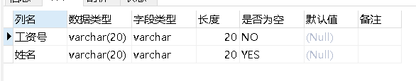
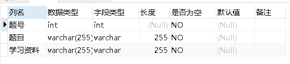
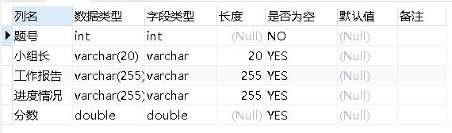
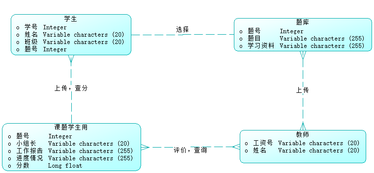

# 设计文档

## 需求分析

`CourseDesignDBMS`（数据库课程设计管理系统）是一个面向客户、学生以及教师的数据库管理系统。设计宗旨在于方便客户浏览湖南大学数据库课程设计的相关信息，帮助学生管理自己的课程设计，便于教师查阅学生的设计以及展开教学工作。

### 功能需求

面对三类人群，`CourseDesignDBMS`的功能如下：

#### 学生

- 登录功能：
  - 使用 `学号`和 `密码(默认为学号)`登录
  - 修改密码
- 选题功能：
  - 从题库中选择题目，并且填写同组其他同学姓名、学号、班级、小组长（选题一旦保存不再修改）
- 查询功能：
  - 查询选题情况
  - 查询课程设计成绩
- 上传功能：
  - 将课程设计各个阶段的工作报告上传系统

#### 教师

- 登录功能：
  - 使用 工号和密码（默认为工号）登录
  - 修改密码
- 评分功能：
  - 填写学生的项目进度情况
  - 给课程设计评分
- 查询功能：
  - 查看学生选题情况
  - 查看学生设计报告
- 上传功能：
  - 上传课程设计的题目
  - 上传学习资料

#### 游客

- 浏览功能
  - 查看课程设计题目
  - 查看学习资料

## 数据字典

#### 教师

#### 学生

#### 题库

#### 课题学生用

## 概念结构设计

### E-R图（by powerdesigner）

## 逻辑结构设计

#### 关系模型

学生（`<u>`学号`</u>`，姓名，班级，题号）

教师（`<u>`工资号`</u>`，姓名）

题库（`<u>`题号，题目，学习资料`</u>`）

课题学生用（`<u>`题号`</u>`，小组长，工作报告，进度情况，分数）

#### 模型结构图（by powerdesigner）

2ML]S)K0XI[M1.png)

## 物理设计

选择索引存取方法：
系统自动在每个表的主码上建立索引；
本项目中大多数查询操作是根据题号进行的，所以在题库表的题号列建立索引；

## 软件概要设计

## 界面设计
