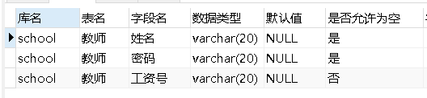
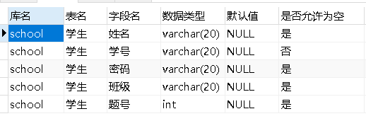
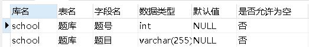
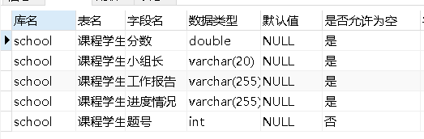
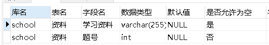
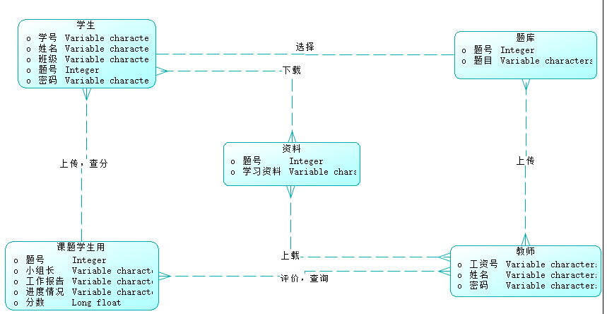
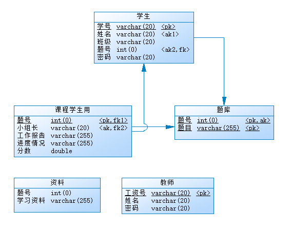

# 设计文档

## 需求分析

`CourseDesignDBMS`（数据库课程设计管理系统）是一个面向客户、学生以及教师的数据库管理系统。设计宗旨在于方便客户浏览湖南大学数据库课程设计的相关信息，帮助学生管理自己的课程设计，便于教师查阅学生的设计以及展开教学工作。

### 功能需求

面对三类人群，`CourseDesignDBMS`的功能如下：

#### 学生

- 登录功能：
  - 使用 `学号`和 `密码(默认为学号)`登录
  - 修改密码
- 选题功能：
  - 从题库中选择题目，并且填写同组其他同学姓名、学号、班级、小组长（选题一旦保存不再修改）
- 查询功能：
  - 查询选题情况
  - 查询课程设计成绩
- 上传功能：
  - 将课程设计各个阶段的工作报告上传系统

#### 教师

- 登录功能：
  - 使用 工号和密码（默认为工号）登录
  - 修改密码
- 评分功能：
  - 填写学生的项目进度情况
  - 给课程设计评分
- 查询功能：
  - 查看学生选题情况
  - 查看学生设计报告
- 上传功能：
  - 上传课程设计的题目
  - 上传学习资料

#### 游客

- 浏览功能
  - 查看课程设计题目
  - 查看学习资料

## 数据字典

#### 教师

#### 学生

#### 题库

#### 课题学生用

#### 资料

## 概念结构设计

### E-R图（by powerdesigner）

## 逻辑结构设计

#### 关系模型

学生（`<u>`学号`</u>`，密码，姓名，班级，题号）

教师（`<u>`工资号`</u>`，密码，姓名）

题库（`<u>`题号`</u>`，题目）

课题学生用（`<u>`题号`</u>`，小组长，工作报告，进度情况，分数）

资料（`<u>`题号，学习资料`</u>`）

#### 模型结构图（by powerdesigner）

## 物理设计

选择索引存取方法：
系统自动在每个表的主码上建立索引；本项目中大多数查询操作是根据题号进行的，所以在题库表的题号列建立索引。
物理存储位置选用数据库管理系统文件夹下的data文件夹中。

## 软件概要设计

​			本软件的设计目的是实现数据库课程设计管理系统，总体分为登录模块和操作模块。不同的用户选择不同的登录方式，登录成功后进入不同的操作页面。学生登录后进入学生操作页面，可以实现题目选择、填写同组学生姓名、学号、小组长、选题、修改密码、查询成绩等功能。教师登录后进入教师操作页面，可以实现查看学生选题情况、查看学生设计报告、填写学生项目进度情况、给出分数等功能。游客无需账号进入操作页面，只能进行资料浏览。

## 界面设计

#### 概述：

该软件共分为个4页面，分别为登录页面和3个操作页面。在登录页面中有学生登录，教师登录，游客访问三种选择。

#### 学生页面：

在登录页面选择学生登录，登录成功后即可跳转到学生操作页面

在学生操作页面有以下功能可以实现，分别是：

**选题申请：**

**选题情况查询：**

**查看资料：**

**上传报告：**

**修改密码：**

**查询成绩：**

#### 教师页面：

在登录界面选择教师登录，登录成功后即可跳转到教师操作界面

教师操作页面分别有以下功能：

**查看学生选题情况：**

**上传文件或资料：**

**修改密码：**

**评分：**

#### 游客页面:

在登录界面选择游客登录，登录成功后即可进行游客操作页面

在游客操作页面有以下功能：

**查看题库和资料：**

